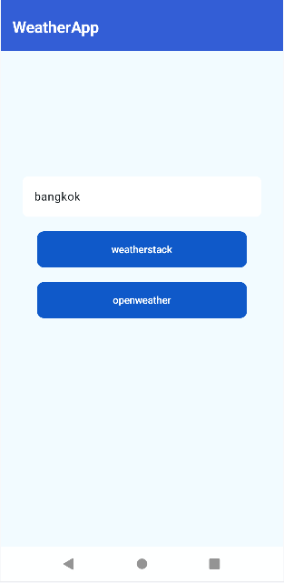
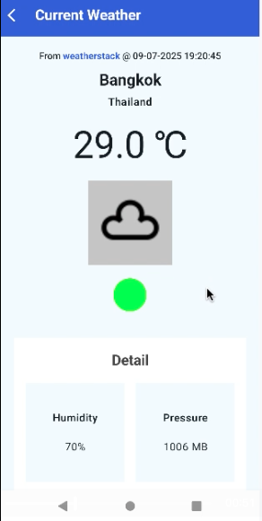

# WeatherApp

# Setup requirement:
- Java 21
- Min Android Studio to use is Android Studio Meerkat that support gradle AGP 8.10.1
- To run this project, a valid weatherstack api key is required (to add to local.properties file)

# API key instruction
## WeatherStack
1. visit https://weatherstack.com/ and register an account to get free api key (100 calls per month)
2. copy the api key to local.properties file as WEATHERSTACK_KEY e.g. WEATHERSTACK_KEY ="your_api_key"

## Openweather
1. visit https://openweathermap.org/ and register an account to get free api key
2. copy the api key to local.properties file as OPENWEATHER_KEY e.g. OPENWEATHER_KEY ="your_api_key"

# Components used:
- jetpack compose
- koin di
- androidx navigation
- coil image
- ktor for network calls
- spotless and klint for code formatting

# media

https://github.com/user-attachments/assets/f75e0555-8c84-43e4-b382-2e4a835ac048

