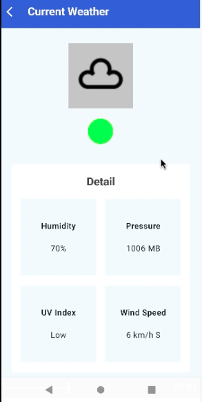

# WeatherApp

# Setup requirement:
- Java 21
- Min Android Studio to use is Android Studio Meerkat that support gradle AGP 8.10.1
- To run this project, a valid weatherstack api key is required (to add to local.properties file)

# API key instruction
1. visit https://weatherstack.com/ and register an account to get free api key ( 100 calls per month, no credit card needed)
2. copy the api key to local.properties file as WEATHERSTACK_KEY e.g. WEATHERSTACK_KEY ="your_api_key"

# Components used:
- jetpack compose
- koin di
- androidx navigation
- coil image
- ktor for network calls
- spotless and klint for code formatting

# media

https://github.com/user-attachments/assets/8288f988-3fa8-4850-a42c-e50afc919122

